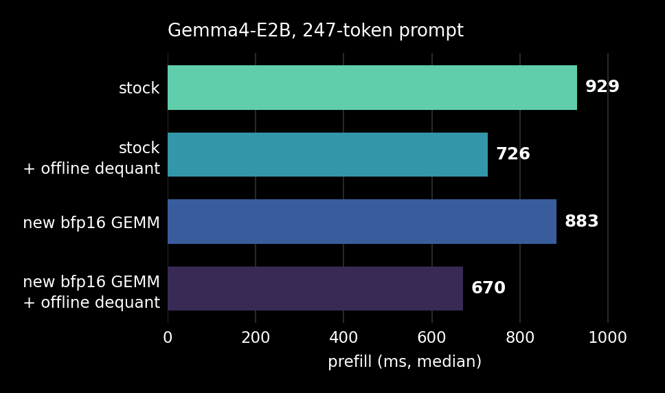

# Operator plugins

This directory demonstrates the plugin mechanism for the FastFlowLM engine.
Plugins let you override individual operators in the end-to-end model without
rebuilding `flm` or any engine library.

We demonstrate it with a plugin in [`flm_gemm/`](flm_gemm) that overrides two
operators in Gemma4 E2B: dequant and matrix multiplication. It enables two
options, independently:

- **Offline dequant.** Stops dequantizing the prefill weights at run time.
  Already-dequantized weights (bf16 or bfp16, depending on the option below) are
  loaded from disk and the dequant step is overridden with a no-op. Faster
  prefill, more disk and more memory.
- **New IRON bfp16 GEMM.** Replaces FastFlowLM's matrix multiplication with an
  open-source implementation from IRON, whose source is
  [here](https://github.com/amd/IRON/tree/devel/iron/operators/flm/gemm). It is a
  faster kernel than stock. It operates on bfp16 (block floating point) where the
  original operates on bf16, so the dequant operator has to be replaced too.



## Overriding an operator

A plugin is a shared library with one entry point. `FLM_PLUGIN` names the
function the engine calls once the model exists and before its weights load:

```cpp
void register_overrides(const flm::plugin_context& ctx) {
    auto hook = std::make_shared<flm_gemm_override>(ctx);
    const size_t bound = hook->bind(*ctx.ops, hook);
    ...
}

FLM_PLUGIN(register_overrides)
```

Operators are named. `flm_gemm` binds itself to each projection of each layer,
and to the dequant steps that feed them:

```cpp
bound += ops.override_op(flm::op_key((int)layer, roles[r]), self);

for (std::string_view dq : { flm::role::dequant_qkv, flm::role::dequant_o,
                             flm::role::dequant_gate, flm::role::dequant_up,
                             flm::role::dequant_down }) {
    ops.override_op(flm::op_key((int)layer, dq), self);
}
```

An override implements one method. It is handed the buffers the engine's own
operator would have received, and runs whatever it likes:

```cpp
flm::op_result create_run(const flm::op_call& call) override {
    ...
    // IRON's argument order is A, B, C; the engine's is C, A, B.
    app(*call.args[1], b, *call.args[0]);
    return flm::op_result();
}
```

Returning `flm::op_result::decline()` instead hands the call back to the engine,
per dispatch — which is how `flm_gemm` restricts itself to the shapes it has
instruction streams for.

Turning an operator *off* is the same mechanism with nothing in it. With offline
dequant selected, the weights are already in place, so the dequant override
returns having done nothing:

```cpp
void _dequant(const flm::op_call& call, layer_entry& layer) {
    if (this->mode_ != weight_mode::dequant) return;  // the weights are already there
    ...
}
```

## Prefill weights

Offline dequant needs the weights dequantized ahead of time, next to
`model.q4nx`. `flm_gemm/tools/dequantize.py` writes them:

```bash
cd flm_gemm/tools
python3 dequantize.py <model_dir> --mode bf16 --only ""
IRON_PATH=<iron> python3 dequantize.py <model_dir> --mode bfp --only "mlp."
IRON_PATH=<iron> python3 dequantize.py <model_dir> --mode bfp --only "self_attn." \
    --out model.dq_bfp_attn
```

`--mode bf16` writes what the engine's `dequant.xclbin` would have written, for
the stock GEMM (3.45 GiB). `--mode bfp` writes the packed form the IRON GEMM
takes (1.94 GiB), calling the operator's own packer so the layout cannot drift
from the kernel's — which is why that mode needs an IRON checkout while `bf16`
needs only numpy.

These sidecars are also the reference for `FLM_DEQUANT_VERIFY=1`, which checks
every buffer the dequant produces against them, byte for byte.

## Reproducing the numbers

One build, one environment variable per configuration:

```bash
cmake -DFLM_BUILD_PLUGINS=ON . && ninja flm flm_gemm_plugin
export FLM_PLUGIN=$PWD/plugins/flm_gemm/flm_gemm_plugin.so

flm serve gemma4-it:e2b                            # new GEMM, run-time dequant
FLM_GEMM_MODE=bf16  flm serve gemma4-it:e2b        # stock GEMM, offline dequant
FLM_GEMM_MODE=bfp16 flm serve gemma4-it:e2b        # new GEMM, offline dequant
FLM_GEMM_OFF=1      flm serve gemma4-it:e2b        # stock, plugin registers nothing
```

Time a 247-token prompt against each and read `prompt_eval_duration`. Run-to-run
spread is about 2%, so differences below ~40 ms need several runs to see.

`bench3.sh` in the internal tree does the timing and prints one
`<label>: median <ms>` line per configuration, which is what the chart is drawn
from:

```bash
{ ./bench3.sh stock
  ./bench3.sh dequant $P
  ./bench3.sh bf16    $P FLM_GEMM_MODE=bf16
  ./bench3.sh bfp16   $P FLM_GEMM_MODE=bfp16; } | grep median > runs.txt
python3 flm_gemm/tools/plot_prefill.py < runs.txt
```

`flm_gemm/README.md` has the artifacts each mode needs and how to check a new
weight shape.

## What a plugin can do

An override owns its dispatch completely. It registers its own xclbins through
the `npu_xclbin_manager` it is handed, creates its own apps, loads its own
instruction streams and allocates its own weights — all through public headers,
so it is built against the public tree and needs no engine source. It may return
a run for the caller to wait on, return having already done the work, or decline
and let the engine proceed.

What the engine keeps is the schedule: which operators exist, in what order they
run, and which buffers they are given. A plugin changes what happens at a step,
not the shape of the model.

Operators are addressed by key — `layers.<i>.<role>`, with `*` matching a whole
segment — and the set is declared by the engine, so `override_op` on an unknown
key throws at registration rather than silently never firing. `list_ops()`
returns it.
